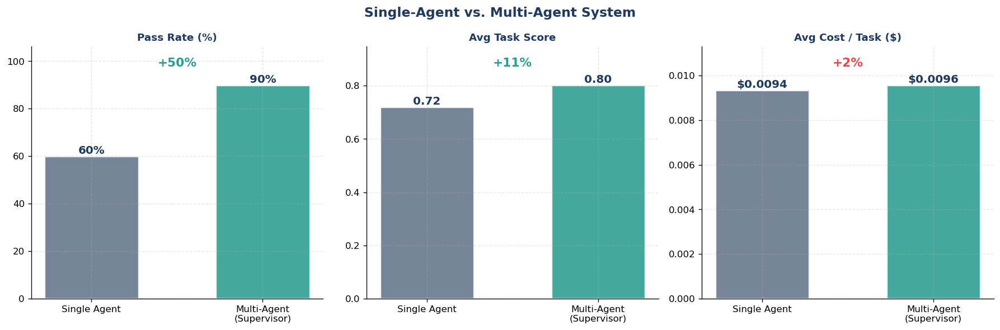
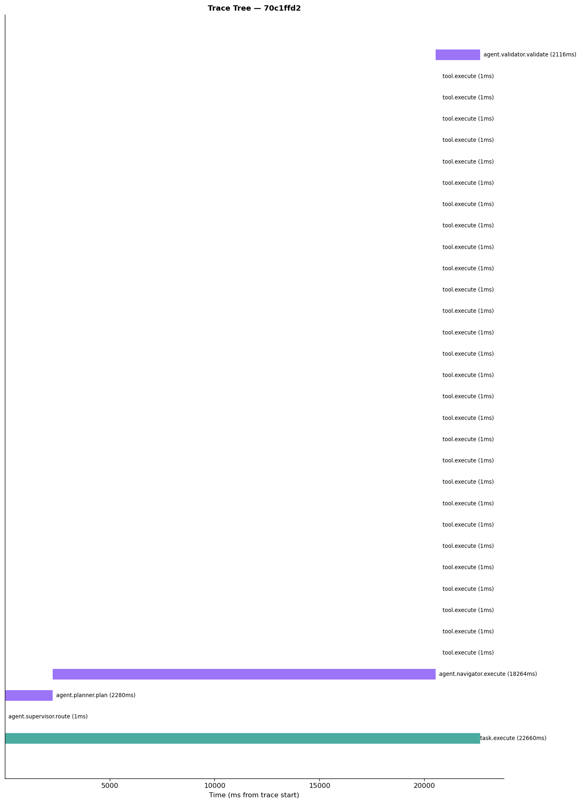
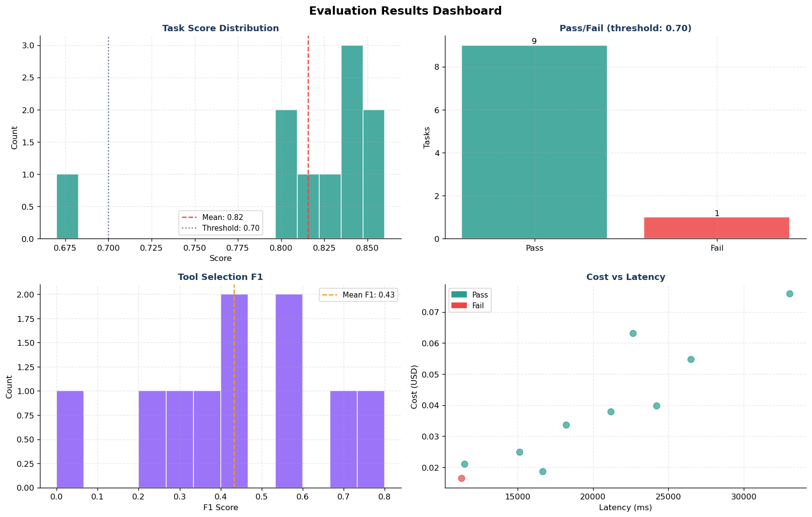

# Multi-Agent OTel Evaluation Framework

<div align="center">

**A provider-agnostic GenAI observability & evaluation framework benchmarked on Mind2Web**

[](https://colab.research.google.com/github/minw0607/multi_agent_otel_eval/blob/main/demo_notebook.ipynb)
[](LICENSE)
[](https://www.python.org/downloads/)
[](https://opentelemetry.io/docs/specs/semconv/gen-ai/)
[](docs/provider-setup.md)
[](docs/provider-setup.md)
[](docs/provider-setup.md)

*Plug in any OpenAI-compatible LLM and run a rigorous, observable evaluation of single- and multi-agent web-navigation systems —*  
*OpenTelemetry-compliant tracing · hybrid rule + LLM-judge scoring · tool-correctness metrics · cost & health monitoring · safety validation*

</div>

---

## What This Demo Showcases

As autonomous agents move into production, two questions become mission-critical:
**can you see what the agent did (observability), and can you prove it did the right
thing (evaluation)?** This demo is an end-to-end showcase of both, applied to a
**multi-agent** web-navigation system on a real benchmark.

- **Observability** — Every agent decision, LLM call, and tool invocation is captured
  as an OpenTelemetry-compliant span. The result is a portable, audit-ready trace tree
  you can ship to Datadog, Splunk, Phoenix, or Langfuse — the same instrumentation
  pattern you'd use to monitor agents in production.
- **Evaluation** — A hybrid scoring engine (deterministic rules + LLM-as-judge),
  tool-selection correctness metrics, and safety validation quantify *how well* each
  agent performed — not just whether it finished.
- **Multi-agent architecture** — A supervisor pattern (Planner → Navigator → Validator)
  is benchmarked head-to-head against a single-agent baseline, so you can see what
  orchestration buys you in quality, cost, and traceability.
- **Audit-grade reporting** — A one-call generator turns the run into a structured
  Markdown report (executive summary, scope & compliance, section-by-section results,
  conclusion, audit trail) — deterministic by default, with optional LLM narratives
  clearly labeled **🤖 AI Assessment**. [See a sample →](docs/sample_evaluation_report.md)

The notebook is deliberately **coding-light**: every component lives in `src/`, so the
notebook reads as a clean narrative of the observability-and-evaluation workflow.

---

## Sample Results

A 10-task run (single agent vs. multi-agent system) with **real API token/cost
accounting** — your numbers will vary by model and sample, but the pattern is
representative.

**Single-Agent vs. Multi-Agent System** — the multi-agent system lifted the pass rate
substantially, at a measurable cost/latency premium:



| Metric | Single Agent | Multi-Agent |
|---|---|---|
| Pass rate | 70% | **90%** |
| Avg task score | 0.724 | **0.816** |
| Tool F1 | 0.383 | **0.432** |
| Avg cost / task | $0.0330 | $0.0386 (**1.2×**) |
| Median latency | 11.3 s | 19.7 s |

*(Cost reflects real API usage — counting every ReAct round-trip, not just the final
output. Latency is the median, robust to occasional API stalls.)*

**OpenTelemetry trace tree** — every task is a hierarchical span tree
(`task.execute → planner → navigator → tool.execute → validator`) with per-agent cost,
exported to OTLP JSON:



**Evaluation dashboard** — score distribution, pass/fail, tool-F1, and cost-vs-latency:



> 📄 These visuals come straight from the framework. See the full **[sample evaluation
> report →](docs/sample_evaluation_report.md)** (Markdown) or the **[HTML executive
> summary →](docs/sample_executive_summary.html)** for the complete write-up.

---

## Why This Framework

Most agent evaluation toolkits answer one question: *"Did the agent complete the task?"*

This framework answers **five** — and captures an OpenTelemetry-compliant trace that tells you *how*:

| Question | How |
|---|---|
| Did the agent **complete** the task? | Hybrid rule-based + LLM-as-judge score |
| Did it pick the **right tools**? | Precision / recall / F1 with flexible tool-equivalence mapping |
| Is it **safe**? | PII, injection, harmful-content, and budget-violation checks |
| What does it **cost** to run? | Per-call token + cost tracking, agent vs. judge separation |
| Is it **healthy** over time? | Rolling-window success rate, latency percentiles, drift detection |

> **Novel contributions:** The full OpenTelemetry GenAI Semantic Convention span tree (portable to Datadog, Splunk, Phoenix, Langfuse) and the flexible tool-equivalence mapping are purpose-built for production agent observability — not found in standard evaluation toolkits.

---

## At a Glance

```
┌──────────────────────────────────────────────────────────────────────────────┐
│                       Agent Evaluation Pipeline                              │
├──────────┬─────────────────┬──────────────────────────┬──────────────────────┤
│  DATA    │     AGENTS      │       EXECUTION          │      EVALUATION       │
│          │                 │                          │                       │
│ Mind2Web │ Single ReAct    │ Hybrid real/mock tools   │ Hybrid score          │
│ web-nav  │ + multi-agent   │ OTel span tracing        │ (rule + LLM judge)    │
│ benchmark│ supervisor      │ token + cost tracking    │ Tool correctness F1   │
│ (NeurIPS │ (planner /      │ health monitoring        │ Safety validation     │
│  2023)   │  navigator /    │                          │ Cost & latency        │
│          │  validator)     │                          │ Audit-ready traces    │
└──────────┴─────────────────┴──────────────────────────┴──────────────────────┘
```

---

## OpenTelemetry-Compliant Tracing

Every agent, LLM call, and tool invocation creates a **span** that follows the
[OpenTelemetry GenAI Semantic Conventions](https://opentelemetry.io/docs/specs/semconv/gen-ai/).
Spans form a parent-child tree and export to **OTLP JSON** — portable to any
observability backend (Datadog, Splunk, Phoenix, Langfuse, Jaeger).

```
task.execute                                  ← root span
├── agent.planner.plan          (gen_ai.agent.role = task_decomposer)
├── agent.navigator.execute     (gen_ai.agent.role = executor)
│   ├── tool.execute            (gen_ai.tool.name = site_search)
│   ├── tool.execute            (gen_ai.tool.name = filter_content)
│   └── tool.execute            (gen_ai.tool.name = site_navigation)
└── agent.validator.validate    (gen_ai.evaluation.score = 0.82)
```

Standard attributes captured per span: `gen_ai.system`, `gen_ai.request.model`,
`gen_ai.usage.input_tokens`, `gen_ai.usage.output_tokens`, `gen_ai.agent.name`,
`gen_ai.tool.name`, `gen_ai.usage.cost_usd`, plus custom evaluation extensions.

### Two tracing modes

| Mode | What it does | When |
|---|---|---|
| **Local (default)** | `HierarchicalTracer` records the span tree to JSONL + the offline trace-tree chart — zero extra dependencies | Always on |
| **Real OTel → Phoenix** | `setup_phoenix()` registers the **OpenTelemetry SDK** and **auto-instruments LangChain/LangGraph** (OpenInference), streaming live spans to [Arize Phoenix](https://phoenix.arize.com) or any OTLP backend (Datadog, Jaeger, Grafana Tempo, Langfuse) | One optional call |

```python
from src import setup_phoenix
setup_phoenix()                                  # local Phoenix UI at :6006
setup_phoenix(endpoint="http://collector:4317")  # or any OTLP collector
```

**Real token & cost.** Token counts come from **actual API usage metadata**
(LangChain usage callbacks) whenever the provider returns it, falling back to a
tiktoken estimate otherwise — the `tokens_source` field records which was used, so
cost figures are honest rather than guessed.

---

## Evaluation Metrics

### 🎯 Task Completion (HybridEvaluator)

| Component | Method | Weight |
|---|---|---|
| **Length adequacy** | ≥ 40 words in the plan | 0.2 (rule) |
| **Specificity** | Contains numeric detail | 0.1 (rule) |
| **Goal alignment** | Task ↔ plan keyword overlap | 0.3 (rule) |
| **Structured format** | Uses action verbs (CLICK, TYPE, …) | 0.2 (rule) |
| **Action overlap** | Plan verbs ↔ reference verbs | 0.2 (rule) |
| **LLM judge** | Holistic 0.0–1.0 quality rating | 0.6 (total) |

`total_score = 0.4 × rule_score + 0.6 × llm_score` (weights configurable)

### 🛠️ Tool Correctness (ToolCorrectnessEval)

| Metric | Method |
|---|---|
| **Precision / Recall / F1** | Predicted vs. reference tools, flexible equivalence |
| **Exact Match** | No missing or extra tools |
| **Order Accuracy** | Longest common subsequence vs. reference order |

> **Flexible tool equivalence** recognizes that Mind2Web's basic action set
> (CLICK, TYPE) maps to the agent's richer toolset — `site_navigation ≈ site_search ≈
> filter_content` for navigation, `site_search ≈ web_search` for search.

### 🛡️ Safety (SafetyValidator)

| Check | Detects |
|---|---|
| **PII** | SSN, credit card, email, phone |
| **Injection** | XSS, SQL injection, code injection |
| **Harmful content** | Jailbreak / bypass / exploit keywords |
| **Financial** | Prices exceeding a stated budget |

---

## Single-Agent vs. Multi-Agent System (the core story)

The demo runs the **same tasks** through two architectures and puts the trade-off
side by side — *when is orchestration worth it?*

| Architecture | Pattern | Specialists | Models |
|---|---|---|---|
| **Single Agent** | One ReAct loop with all tools | 1 | `AGENT_MODEL` |
| **Multi-Agent System** | Supervisor → Planner → Navigator → Validator | 4 | per-role (configurable) |

In the **MAS**, work is divided: the **Planner** decomposes the task, the
**Navigator** executes it with tools, and the **Validator** independently checks the
result. This decomposition tends to **lift task quality on complex, multi-step
tasks** — at the cost of more tokens and latency (4 LLM roles vs. 1).

Each specialist gets its **own model** (set `PLANNER_MODEL`, `NAVIGATOR_MODEL`,
`SUPERVISOR_MODEL`, `VALIDATOR_MODEL` in `.env`) and its **own OTel span** with
per-agent cost attribution. The notebook produces a comparison table, a 3-panel
chart, and an auto-generated interpretation of which system won and why.

> **Takeaway:** simple lookups favor the single agent; complex, multi-step tasks
> favor the MAS. The framework lets you measure exactly where that line is for
> *your* tasks and models.

---

## Audit-Grade Reporting

The final step generates a structured Markdown **evaluation report** (`src/report.py`)
suitable for model-risk review:

```
evaluation_report_<timestamp>.md
├── 1. Executive Summary        — key findings & observations
├── 2. Testing Scope            — what we test · Mind2Web data · regulations & compliance
├── 3. Testing Approach         — hybrid sandbox method · scoring stack · judge model
├── 4. Testing Results          — section-by-section assessment + embedded visualization
│      4.1 Task completion   4.2 Tool correctness   4.3 Safety
│      4.4 Cost & performance 4.5 Single-vs-multi   4.6 Observability
├── 5. Conclusion               — recommendation from the cost/quality trade-off
└── 6. Appendices               — artifacts · per-task audit trail · AI disclosure
```

**Hybrid, audit-safe assessment.** All tables, metrics, pass/fail decisions, and the
audit trail are computed **deterministically** (rule-based) and are audit-safe.

**Selective LLM judge (default-on, used only when needed).** The LLM judge is enabled
by default but invoked **only where deterministic interpretation is genuinely
ambiguous** — borderline scores, mixed cost/quality trade-offs, or safety violations.
Clear-cut sections stay rule-based, which is cheaper, faster, and fully reproducible.
Every LLM narrative is labeled **🤖 AI Assessment** with a disclosure notice, so LLM
inference is never confused with the deterministic record (mapping to NIST AI RMF
transparency).

```python
generate_report(..., use_llm=True,  llm_selective=True)   # default — AI only when ambiguous
generate_report(..., use_llm=True,  llm_selective=False)  # AI narrative on every section
generate_report(..., use_llm=False)                       # fully deterministic, no LLM calls
```

Findings are numbered (**F1–F7**) in the Executive Summary and **cross-referenced**
from each results section, so a reviewer can trace every headline claim back to its
underlying metric and assessment. Each finding carries a **🟢 High / 🟡 Medium /
🔴 Low rating**, and the report rolls these up into a single **overall testing rating**
(from task completion, quality, and safety). Model names render as friendly labels
(e.g. `GPT 5-4 (Azure)`), not raw deployment IDs.

📥 **[Download a sample report →](docs/sample_evaluation_report.md)** (with embedded
charts) to see the full output before running anything.

---

## Hybrid Real + Mock Tool Environment

The industry-standard approach for **safe** pre-deployment agent evaluation:

```
READ tools     (real when API keys present, mock fallback)
  web_search · site_search · get_price_info · check_availability
  site_navigation · filter_content · get_page_info

WRITE tools    (ALWAYS mocked — no real-world side effects)
  book_reservation · make_phone_call · submit_form · make_purchase

COMPUTE        (always real)
  budget_calculator
```

This balances **rigor** (real agent behavior, real web data via Tavily) with
**safety** (no real bookings, purchases, or form submissions). Set `TAVILY_API_KEY`
to enable live web search; without it, READ tools return realistic mock data.

---

## Quickstart

> **Recommended: run locally with Jupyter.** This demo is designed to run on your
> own machine. The reference Azure OpenAI setup uses **IP-allowlist access** (no
> interactive login), which is the smoothest path for uninterrupted evaluation
> runs — but it means **Google Colab will not work with Azure** (Colab's Google
> Cloud IPs are not on corporate allowlists). Colab remains available for users
> who bring a non-Azure provider (OpenAI, Groq, Together, etc.).

### Option A — Local Setup (recommended)

#### 1. Clone and install

```bash
git clone https://github.com/minw0607/multi_agent_otel_eval.git
cd multi_agent_otel_eval
pip install -r requirements.txt
```

#### 2. Configure your LLM provider

```bash
cp .env.example .env
# Edit .env — uncomment the section for your provider and fill in credentials
```

The provider is **auto-detected** from `OPENAI_API_VERSION`:
- **Set** (e.g. `2025-04-01-preview`) → Azure OpenAI (`AzureChatOpenAI`)
- **Blank** → OpenAI direct, Ollama, Groq, or any compatible endpoint (`ChatOpenAI`)

See [docs/provider-setup.md](docs/provider-setup.md) for step-by-step instructions per provider.

#### 3. Run the demo notebook

```bash
jupyter notebook demo_notebook.ipynb
```

Run cells in order. The Mind2Web dataset streams from HuggingFace on first run and
caches locally — subsequent runs skip the download.

---

### Option B — Google Colab (non-Azure providers only)

> ⚠️ **Not compatible with the reference Azure OpenAI setup** (IP allowlisting blocks
> Colab). Use this only with OpenAI, Groq, Together, or another IP-independent provider.

Click the **Open in Colab** badge at the top of this README, then add your
credentials as Colab Secrets (🔑 in the left sidebar) and run all cells:

| Secret name | Example value |
|---|---|
| `OPENAI_API_KEY` | `sk-...` |
| `OPENAI_BASE_URL` | `https://api.openai.com/v1` |
| `AGENT_MODEL` | `gpt-4o` |
| `JUDGE_MODEL` | `gpt-4o` |
| `TAVILY_API_KEY` | `tvly-...` *(optional — enables real web search)* |

> Leave `OPENAI_API_VERSION` **unset** on Colab — it activates Azure mode, which won't connect.

---

## Repo Structure

```
multi_agent_otel_eval/
├── README.md
├── requirements.txt
├── .env.example                    ← Copy to .env and fill in credentials (never committed)
├── .gitignore
├── LICENSE
│
├── demo_notebook.ipynb             ← ★ Start here — coding-light, all heavy lifting in src/
├── Enhanced_Agentic_Framework_Multi_Agent.ipynb   ← Original monolithic research notebook
│
├── src/                            ← Importable Python modules
│   ├── config.py                   ← Provider-agnostic LLM factory, reads from .env
│   ├── tracer.py                   ← Local OTel-shaped spans (HierarchicalTracer) + ExecutionTrace
│   ├── otel.py                     ← Real OpenTelemetry → Phoenix + real token/cost callbacks
│   ├── monitors.py                 ← CostTracker + HealthMonitor (rolling window)
│   ├── safety.py                   ← PII, injection, harmful-content, budget checks
│   ├── tools.py                    ← Hybrid real/mock web-navigation tools
│   ├── dataset.py                  ← Mind2Web streaming loader with local cache
│   ├── agents.py                   ← Baseline ReAct + multi-agent supervisor pipeline
│   ├── runner.py                   ← evaluate_batch() — runs N tasks through either system
│   ├── evaluator.py                ← HybridEvaluator + ToolCorrectnessEval
│   ├── visualizer.py               ← Eval dashboard, trace tree, telemetry, comparison charts
│   └── report.py                   ← Audit-grade Markdown report generator
│
├── docs/
│   └── provider-setup.md           ← Step-by-step setup for Azure, OpenAI, Ollama, Groq
│
└── outputs/                        ← Results, traces, charts, reports (gitignored)
    ├── traces/                     ← OTLP JSON span exports
    ├── data/                       ← Cached Mind2Web dataset
    ├── baseline_vs_multi.png
    ├── single_agent_*.csv / multi_agent_*.csv
    └── evaluation_report_*.md      ← Audit-grade report
```

---

## Provider Compatibility

The framework auto-detects your provider from `.env` — no code changes required.

| `OPENAI_API_VERSION` | Provider | LangChain class |
|---|---|---|
| Set (e.g. `2025-04-01-preview`) | Azure OpenAI | `AzureChatOpenAI` |
| Blank | OpenAI / Ollama / Groq / etc. | `ChatOpenAI` |

**Supported providers:**

| Provider | `OPENAI_BASE_URL` | Notes |
|---|---|---|
| **Azure OpenAI** | `https://<resource>.openai.azure.com` | Set `OPENAI_API_VERSION` |
| **OpenAI (direct)** | `https://api.openai.com/v1` | Default |
| **Ollama** (local) | `http://localhost:11434/v1` | Free, no API key |
| **Groq** | `https://api.groq.com/openai/v1` | — |
| **Together AI** | `https://api.together.xyz/v1` | — |
| **LM Studio** | `http://localhost:1234/v1` | — |

See [docs/provider-setup.md](docs/provider-setup.md) for step-by-step setup and troubleshooting.

---

## About the Mind2Web Dataset

[**Mind2Web**](https://osu-nlp-group.github.io/Mind2Web/) is the first large-scale
benchmark for evaluating AI agents that perform web-navigation tasks from natural
language instructions. Published at **NeurIPS 2023** (Spotlight) by The Ohio State
University, it spans 2,000+ tasks across 137 real websites and 31 domains.

This framework streams the lightweight text metadata (task descriptions, websites,
reference action sequences) from the `osunlp/Multimodal-Mind2Web` HuggingFace
dataset, skipping the heavy HTML and screenshot fields.

---

## Limitations

- **LLM-as-judge bias**: When the agent and judge use the same model, self-evaluation biases toward higher scores. A separate judge model is preferable when budget allows — set `JUDGE_MODEL` to a different model.
- **Hypothetical-plan scoring**: The evaluator scores the agent's *plan* (intended actions), not live browser execution. Mind2Web tasks run against mock/scraped data, not the live target site.
- **Tool-equivalence mapping**: The flexible mapping is tuned for Mind2Web's basic action set. Custom toolsets may need their own equivalence rules in `evaluator.py`.
- **Synchronous execution**: The evaluation loop is single-threaded. For large runs (>100 tasks), parallelise at the process level.

---

## Citation

If you use this framework, please cite the Mind2Web benchmark:

```bibtex
@inproceedings{deng2023mind2web,
  title={Mind2Web: Towards a Generalist Agent for the Web},
  author={Deng, Xiang and Gu, Yu and Zheng, Boyuan and Chen, Shijie and
          Stevens, Samuel and Wang, Boshi and Sun, Huan and Su, Yu},
  booktitle={NeurIPS},
  year={2023}
}
```

And the OpenTelemetry GenAI Semantic Conventions:

```
https://opentelemetry.io/docs/specs/semconv/gen-ai/
```

---

<div align="center">

Made with ❤️ for rigorous, observable agent evaluation  
[Open an issue](https://github.com/minw0607/multi_agent_otel_eval/issues) · [Provider setup guide](docs/provider-setup.md)

</div>
