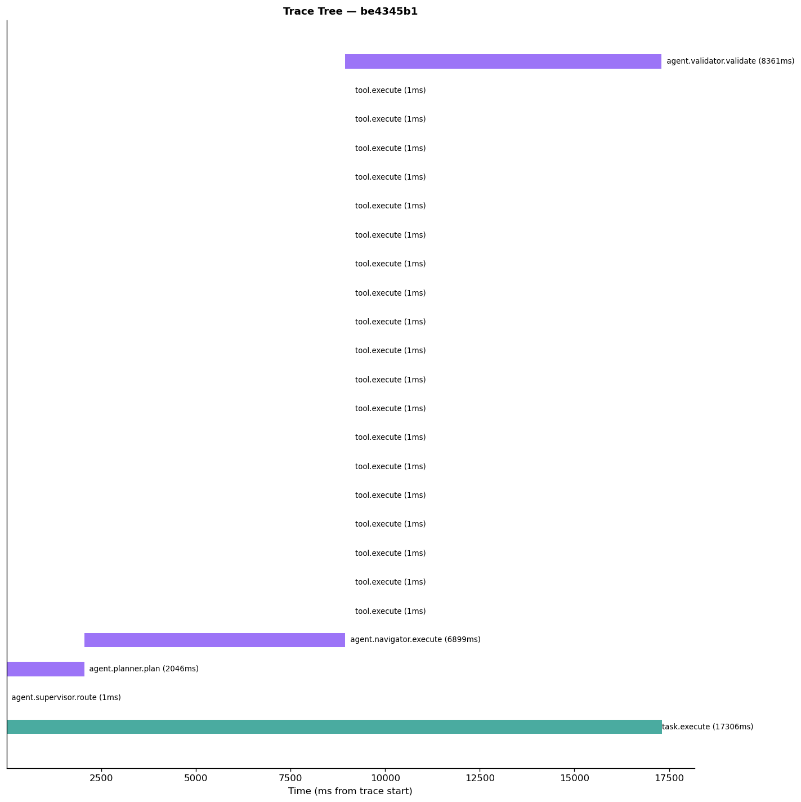
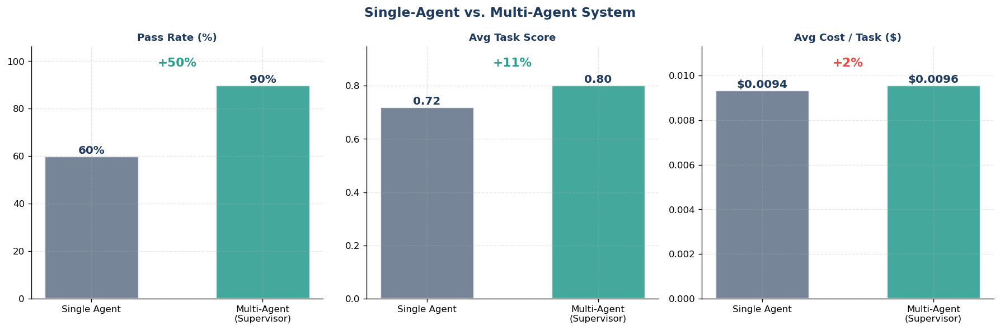
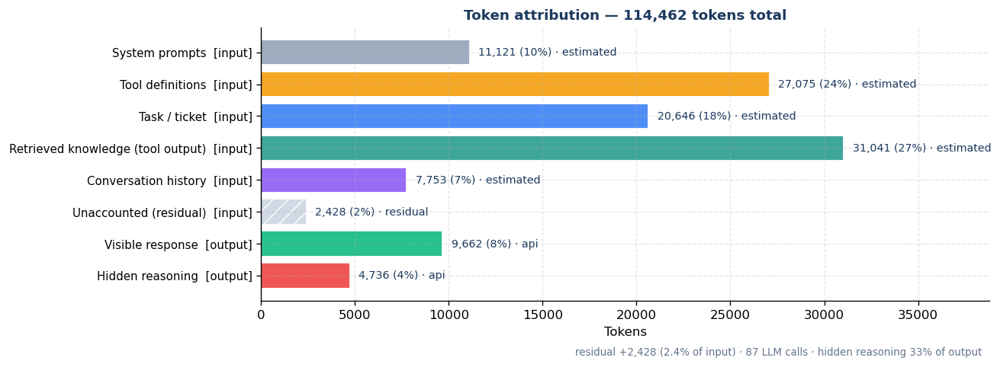
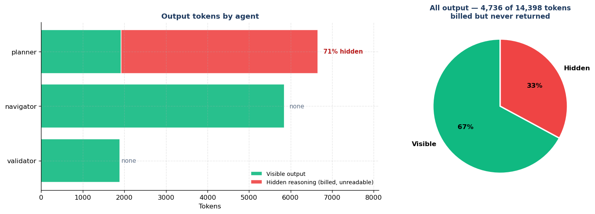

# Multi-Agent OTel Evaluation Framework

<div align="center">

**Observability and evaluation for multi-agent LLM systems — from whole-run traces down to individual tokens.**

[](LICENSE)
[](https://www.python.org/downloads/)
[](https://opentelemetry.io/docs/specs/semconv/gen-ai/)
[](https://langchain.com)
[](docs/provider-setup.md)
[](#disclaimer)

*OpenTelemetry tracing · hybrid + outcome evaluation · safety validation · audit-grade reporting*
*— and a token-level zoom-in that the same instrumentation makes possible*

</div>

> **Status:** Independent personal research project

---

## The idea: one instrumentation, two depths

Agent observability usually stops at the trace: *which steps ran, how long, what did they
cost in total.* That answers most operational questions. But the moment you ask **"why did
this cost 12,000 tokens?"**, a trace can't help — it reports totals, not composition.

This framework instruments agents once, then reads that instrumentation at two depths:

```
┌─ LAYER 1 · Observability & Evaluation ─────────────────────────────────────┐
│                                                                             │
│   Did the agent do the job? Can I see what it did?                          │
│                                                                             │
│   OpenTelemetry span trees · hybrid rule + LLM-judge scoring                │
│   tool-correctness metrics · safety validation · cost & latency             │
│   single-agent vs multi-agent comparison · audit-grade reports              │
│                                                                             │
│      ┌─ LAYER 2 · Token & Reasoning Transparency ───────────────────┐       │
│      │                                                              │       │
│      │   Zoom in: where did each token actually go?                 │       │
│      │                                                              │       │
│      │   context composition · hidden reasoning · duplicate         │       │
│      │   retrievals · plan-vs-execution faithfulness                │       │
│      │   provenance tiers · residual reconciliation                 │       │
│      │                                                              │       │
│      └──────────────────────────────────────────────────────────────┘       │
│                                                                             │
└─────────────────────────────────────────────────────────────────────────────┘
```

Layer 2 isn't a separate tool — it's what becomes visible once every LLM call is recorded
individually and every prompt's composition is captured at assembly time. **A backend can
tell you a call used 4,312 input tokens. It cannot tell you 1,900 of them were tool
definitions the agent never used**, because that has to be emitted while the prompt is
being built, not recovered afterwards.

### The two notebooks

| Notebook | Layer | Question | Benchmark |
|---|---|---|---|
| **[`agentic_otel_demo_notebook.ipynb`](agentic_otel_demo_notebook.ipynb)** | 1 | *How well does the agent perform, and can I see what it did?* | [Mind2Web](https://osu-nlp-group.github.io/Mind2Web/) web navigation |
| **[`token_transparency_notebook.ipynb`](token_transparency_notebook.ipynb)** | 2 | *Where did every token go, and how much of it can anyone see?* | Customer-support desk (real tools) |

Both run on the same `src/` package. The notebooks stay deliberately coding-light — every
component lives in `src/`, so each reads as a narrative rather than a script.

---

## Layer 1 — Observability & evaluation

**Every agent decision is an OpenTelemetry span.** Traces follow the
[GenAI Semantic Conventions](https://opentelemetry.io/docs/specs/semconv/gen-ai/) and
export as OTLP, so they drop into Phoenix, Datadog, Jaeger, Tempo, or Langfuse unchanged.

```
task.execute
├── agent.supervisor.route      (deterministic — 0 tokens)
├── agent.planner.plan          gen_ai.agent.role = task_decomposer
├── agent.navigator.execute     gen_ai.agent.role = tool_executor
│   ├── llm.chat.completion     per-call usage, context composition
│   └── tool.execute            gen_ai.tool.name, output size, fingerprints
└── agent.validator.validate    gen_ai.evaluation.score
```



**Evaluation answers five questions**, not just "did it finish":

| Question | How |
|---|---|
| Did it **complete** the task? | Hybrid rule-based + LLM-as-judge score |
| Did it pick the **right tools**? | Precision / recall / F1 against reference actions |
| Is it **safe**? | PII, injection, harmful-content, budget checks |
| What did it **cost**? | Real per-call token + cost accounting, agent vs. judge split |
| Is it **healthy** over time? | Rolling success rate, latency percentiles, drift |

### Does orchestration pay for itself?

The framework runs single-agent and multi-agent systems over identical tasks:



| Metric | Single agent | Multi-agent | |
|---|---|---|---|
| Pass rate | 60% | **100%** | 🟢 |
| Avg task score | 0.697 | **0.809** | 🟢 |
| Cost / task | $0.0346 | $0.0414 (1.2×) | 🟡 |
| Median latency | 8.3 s | 19.5 s | 🟡 |

Real quality gain, modest cost premium — and, less obviously, the multi-agent
decomposition also makes reasoning **auditable**, which Layer 2 exploits.

📄 **[Sample evaluation report](docs/sample_evaluation_report.md)** · **[HTML executive summary](docs/sample_executive_summary.html)**

---

## Layer 2 — Token & reasoning transparency

Layer 1 tells you a 15-ticket run cost **114,506 tokens and $0.34**. Layer 2 tells you
*where they went*:



| Finding | Number |
|---|---|
| **Tool definitions** — resent every turn, used or not | **23.6%** of all tokens |
| Retrieved knowledge (tool output) | 27.3% |
| Conversation history re-sent | 6.8% |
| **Hidden reasoning** — billed, never returned | **34% of all output** |
| Residual (decomposition vs. reported total) | **+2.1%**, disclosed |

Nearly a quarter of every token went to *re-declaring tools*, most never called. That is
invisible in any per-request total, and it is immediately actionable.

**Hidden reasoning is a model choice, not a workload property.** The planner runs a
reasoning model; the other agents don't. You pay for the red:



**Every number carries its provenance** — how it was obtained (`api` / `estimated` /
`residual`) and how far it can be **checked**:

| Tier | Meaning |
|---|---|
| `verified` | We hold the content *and* counted it ourselves — fully re-checkable |
| `trusted` | The vendor counted it, but we hold what it refers to, so it *could* be cross-checked |
| `asserted` | The vendor counted it and the content is **withheld** — nothing exists to check against |

The gap between `trusted` and `asserted` is **auditability, not confidence**: visible
output can be re-tokenized, hidden reasoning cannot, because the text never arrives. When
the decomposition disagrees with the provider's total, the **residual is printed, not
hidden**.

**Reasoning is checked, not read.** Chain-of-thought is often unfaithful, so the framework
compares the planner's *stated* steps against the navigator's *actual* tool calls —
deterministically, no judge required.

### The instrument is stable; the agent is not

Across four identical 15-ticket runs:

| | Range across runs |
|---|---|
| Tool-definition share | **23.6 – 23.7%** |
| Residual | **+2.1%** every run |
| Total tokens | 114.5k ± 0.1k |
| — | |
| Agent pass rate | **67 – 87%** |
| False escalations | 2 – 5 |

Measurement reproduces to a tenth of a percentage point while agent behaviour swings
twenty. That separation is the point of instrumenting: **variance you can see is variance
you can manage.**

### Measure → diagnose → fix → re-measure

Outcome scoring surfaced a bias that trajectory scoring would have passed, and the fix
closed the loop.

**What it caught.** Across four runs, *every* failure was the same thing: the agent
escalated when policy said not to — 2 to 5 false escalations per run, and **zero missed
escalations**. Perfectly asymmetric. Trajectory scoring passes these runs happily; the
agent used sensible tools in a sensible order. Only checking outcomes against ground
truth exposed it.

**The diagnosis.** Not a model failure — a prompt failure. The navigator prompt listed
the escalation triggers prominently while never stating that resolving the ticket is the
default. The agent learned to escalate whenever a case looked *difficult*, which is a
different thing from a trigger being present.

**The fix.** State that drafting is the default action, require the agent to name which
specific trigger appears in the ticket text, and enumerate the difficult-but-ordinary
cases it must handle itself (answer spans two policies, the obvious article doesn't
apply, an order can't be actioned as assumed).

| | Before | After |
|---|---|---|
| Pass rate | 67 – 87% | **93%** |
| False escalations | 2 – 5 | **1** |
| Missed escalations | 0 | **0** |

The zero in the last row matters: the fix removed false positives without introducing
false negatives, which is the failure mode a blunter "escalate less" instruction would
have caused. Token attribution barely moved (tool definitions 21–24%, residual ~2%) —
the instrument stayed stable while the behaviour it measured improved.

📖 **[Methodology and what's measurable](docs/transparency_spec.md)**

---

## Quickstart

```bash
git clone https://github.com/minw0607/multi_agent_otel_eval.git
cd multi_agent_otel_eval
pip install -r requirements.txt
cp .env.example .env          # add your provider credentials
jupyter notebook agentic_otel_demo_notebook.ipynb
```

Provider is auto-detected: set `OPENAI_API_VERSION` for Azure OpenAI, leave blank for
OpenAI / Ollama / Groq / any compatible endpoint. Per-provider setup:
**[docs/provider-setup.md](docs/provider-setup.md)**.

> **Run locally.** The reference Azure setup uses IP-allowlist access (no interactive
> login), which keeps evaluation runs uninterrupted but means Colab cannot reach it. Colab
> works fine with any IP-independent provider.

Optional — stream live traces to a real backend:

```python
from src import setup_phoenix
setup_phoenix()      # Phoenix UI at http://localhost:6006
```

---

## How it works

```
┌───────────────────────────────────────────────────────────────────────────┐
│  DATA              AGENTS                EXECUTION           EVALUATION    │
│                                                                            │
│  Mind2Web       Single ReAct         Real + mock tools    Hybrid scoring   │
│  benchmark      ── or ──             OTel span tracing    Tool correctness │
│                 Multi-agent MAS      per-call token       Safety checks    │
│  Support        supervisor →         attribution          Outcome vs       │
│  corpus         planner →            reasoning capture    ground truth     │
│  (real tools)   navigator →                               Audit report     │
│                 validator                                                  │
└───────────────────────────────────────────────────────────────────────────┘
```

**The multi-agent system** is built with LangChain + LangGraph. Only the Navigator is a
true ReAct graph; the Supervisor is deterministic routing that costs **zero tokens**, and
the Planner and Validator are single model calls with role prompts. Each specialist can
run a different model.

**Instrumentation** attaches through LangChain callbacks, so every LLM call is recorded
individually — which is precisely what makes Layer 2 possible.

### Documentation

| Guide | Covers |
|---|---|
| **[Observability](docs/observability.md)** | OpenTelemetry from first principles + setup for Phoenix, Jaeger, Tempo, Datadog, Splunk, Langfuse |
| **[Evaluation](docs/evaluation.md)** | Metrics reference, trajectory vs. outcome scoring, tool environments, judge policy |
| **[Token & reasoning transparency](docs/transparency_spec.md)** | Layer 2 methodology: invariants, provenance tiers, what's measurable and what isn't |
| **[Provider setup](docs/provider-setup.md)** | Step-by-step for Azure, OpenAI, Ollama, Groq, Together, LM Studio |

---

## Repo structure

```
multi_agent_otel_eval/
├── agentic_otel_demo_notebook.ipynb    ← Layer 1: evaluation + observability
├── token_transparency_notebook.ipynb   ← Layer 2: token & reasoning attribution
│
├── src/
│   ├── config.py            Provider-agnostic LLM factory, cost table
│   ├── tracer.py            OTel spans, per-span provenance
│   ├── otel.py              Real OTel export · Usage · per-call recorder
│   ├── agents.py            Mind2Web single + multi-agent systems
│   ├── support_agents.py    Support-desk MAS (real tools, instrumented)
│   ├── support_tools.py     Real tools under an enforced sandbox contract
│   ├── support_dataset.py   Labeled corpus + ground truth
│   ├── evaluator.py         Hybrid scoring, tool correctness, outcome eval
│   ├── attribution.py       Token attribution and derived metrics
│   ├── reasoning.py         Plan–execution divergence, reasoning provenance
│   ├── interpret.py         Rule-based chart interpretation
│   ├── visualizer.py        Dashboards, trace trees, attribution charts
│   ├── report.py            Audit-grade Markdown + HTML reports
│   └── runner.py            Batch evaluation
│
├── data/support/            KB articles, policies, orders, labeled tickets
├── docs/                    Guides (see table above)
└── outputs/                 Results, traces, charts (gitignored)
```

---

## Limitations

- **Trajectory ≠ outcome.** The Mind2Web notebook scores the agent's *plan* against
  reference actions; WRITE actions are mocked, so real consequences are unobservable by
  design. The support desk closes part of this gap with ground truth. See
  [docs/evaluation.md](docs/evaluation.md).
- **We trust the vendor's token counts.** We verify context we assembled ourselves, but
  cannot audit the provider's reported usage — hence the `trusted` tier.
- **Hidden reasoning is only ever a number.** Size is reported; content is withheld. No
  amount of instrumentation recovers it.
- **Cost is an estimate even when tokens are exact.** Cache hits depend on state outside
  your control, so identical requests can bill differently.
- **This is the ceiling for a stack you own.** None of it audits a third-party agent — and
  the distance between this ceiling and what commercial agents disclose *is* the
  transparency gap.
- **LLM-as-judge bias.** Use a different model for the judge than the agent, and calibrate
  against human labels before trusting a judge score.

---

## Citation

```bibtex
@inproceedings{deng2023mind2web,
  title={Mind2Web: Towards a Generalist Agent for the Web},
  author={Deng, Xiang and Gu, Yu and Zheng, Boyuan and Chen, Shijie and
          Stevens, Samuel and Wang, Boshi and Sun, Huan and Su, Yu},
  booktitle={NeurIPS},
  year={2023}
}
```

Aligned with the [OpenTelemetry GenAI Semantic Conventions](https://opentelemetry.io/docs/specs/semconv/gen-ai/).

---

## Scope and caveats

Research and evaluation framework. The support-desk corpus is synthetic; company names,
policies, and orders in it are fictional. Numbers shown are from specific runs and will
vary by model, provider, and sample. Nothing here constitutes a vendor audit.

<a id="disclaimer"></a>

## 🧾 Disclaimer

This repository is an independent personal project created outside of my employment using my own time and equipment.

Unless explicitly stated otherwise, the code, notebooks, demonstrations, analyses, and documentation in this repository are developed independently, using only publicly available research papers, technical documentation, regulations, and other public sources. They do not rely on, incorporate, or disclose any confidential, proprietary, non-public, or client information obtained through my employment or professional engagements.

The views, designs, implementations, and conclusions expressed in this repository are solely my own and do not represent the views of any employer, client, or affiliated organization.

This repository is provided for research and educational purposes only.

---

<div align="center">

[Open an issue](https://github.com/minw0607/multi_agent_otel_eval/issues) ·
[Observability](docs/observability.md) ·
[Evaluation](docs/evaluation.md) ·
[Transparency](docs/transparency_spec.md) ·
[Provider setup](docs/provider-setup.md)

</div>
