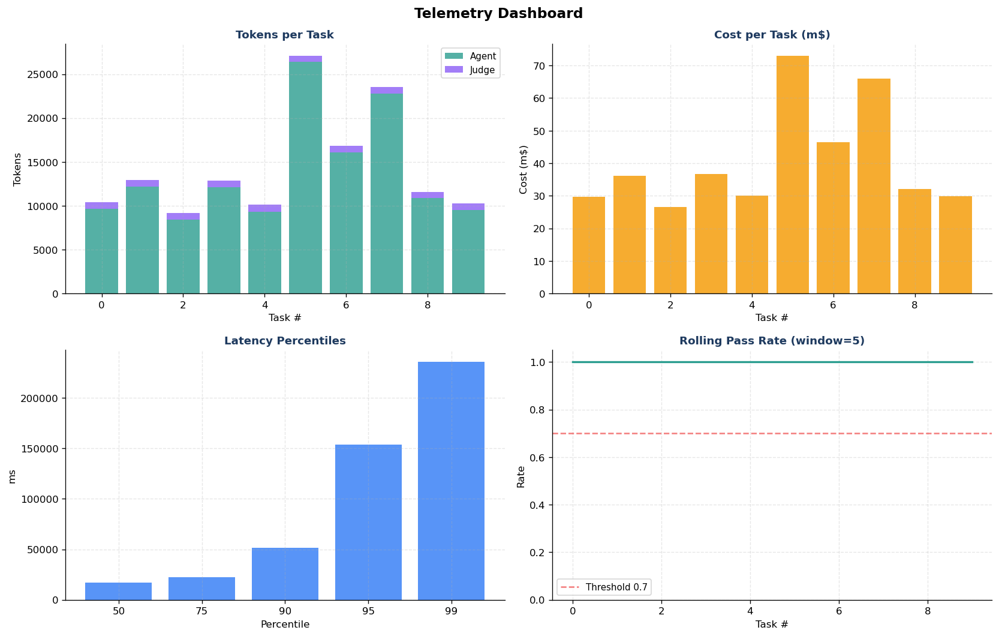

> 📄 **Sample report** — example output of Step 13 (`src/report.py`). It uses the
> **default selective LLM-judge policy**: assessments are rule-based, and the
> **🤖 AI Assessment** narrative appears only where deterministic reading is ambiguous
> (here, §4.2 Tool Correctness). The illustrative AI text shown is representative of the
> format. Embedded charts are included in this folder.

---

# Agent Evaluation Report

**Multi-Agent Observability & Evaluation Framework** · Mind2Web benchmark

- **Generated:** 2026-06-04 00:24
- **Agent model:** `gpt-5-4-20260305-gs` · **Judge model:** `gpt-4-1-20250414-gs`
- **Tasks evaluated:** 10 (per architecture) · **Pass threshold:** 0.70
- **Report type:** Pre-deployment sandbox evaluation

---

## 1. Executive Summary

This report evaluates an AI web-navigation agent on **10 Mind2Web tasks**, comparing a single-agent baseline against a multi-agent system (MAS) using the supervisor pattern (Planner → Navigator → Validator). Every run is instrumented with OpenTelemetry-compliant tracing and scored across task completion, tool selection, safety, cost, and latency.

### Key Findings

- **F1.** **Task completion:** MAS pass rate **90%** vs. single-agent **60%** (+30 pp). *(see §4.1)*
- **F2.** **Quality:** MAS average score **0.803** vs. **0.720** for the single agent. *(see §4.1)*
- **F3.** **Tool correctness:** MAS tool-F1 **0.509** vs. **0.389**. *(see §4.2)*
- **F4.** **Cost:** MAS **$0.0096/task** vs. **$0.0094/task** (1.0× the single-agent cost). *(see §4.4)*
- **F5.** **Latency:** MAS **20134 ms/task** vs. **14768 ms/task**. *(see §4.4)*
- **F6.** **Safety:** **100%** of MAS outputs passed all safety checks (PII, injection, harmful content). *(see §4.3)*
- **F7.** **Overall:** the **Multi-Agent System** delivered higher task quality on this sample. *(see §4.5)*

> *Rule-based assessment is unambiguous here; the LLM judge was not invoked for this section.*

---

## 2. Testing Scope

### 2.1 What We Are Testing

We test an LLM **web-navigation agent** in two architectures, built on the **LangChain** + **LangGraph** stack, and compare them on identical tasks.

**System A — Single Agent (baseline).** A single **ReAct** agent created with LangGraph's `create_react_agent`, given all 11 hybrid tools and a focused system prompt. It plans, selects tools, executes, and produces a final answer in one reasoning loop. Model: `gpt-5-4-20260305-gs`.

**System B — Multi-Agent System (supervisor pattern).** Work is decomposed across four specialists, each a LangChain chat model with its own role, prompt, and (optionally) its own model; per-agent token use and cost are tracked individually:

| Specialist | Role | Framework component | Tools | Model |
|---|---|---|---|---|
| **Supervisor** | Routes the pipeline (sequential) | LangChain chat model | no | `gpt-5-4-20260305-gs` |
| **Planner** | Decomposes the task into 3–5 steps | LangChain chat model | no | `gpt-5-4-20260305-gs` |
| **Navigator** | Executes the plan with tools | LangGraph `create_react_agent` | **yes** | `gpt-5-4-20260305-gs` |
| **Validator** | Independently judges completion & quality | LangChain chat model | no | `gpt-4-1-20250414-gs` |

- **Tooling:** 11 hybrid tools (`src/tools.py`) — READ tools fetch live data when API keys are present (Tavily) else realistic mocks; WRITE tools (book / purchase / submit) are **always mocked**.
- **Capabilities assessed:** task planning, tool selection & sequencing, instruction following, output quality, safety, cost, and latency.
- **Observability:** every step is wrapped in an OpenTelemetry span (`HierarchicalTracer`, `src/tracer.py`) following GenAI Semantic Conventions.
- **Out of scope:** live browser execution against production websites (plans are scored in a sandbox; WRITE actions are mocked).

### 2.2 Testing Data

- **Benchmark:** Mind2Web (NeurIPS 2023, OSU NLP) — natural-language web tasks across 137 real websites and 31 domains.
- **Sample:** 10 tasks drawn from the cached corpus of 300 streamed tasks.
- **Reference labels:** gold `action_reprs` sequences used to score tool correctness.
- **Domains represented in this run:** budget, discogs, ign, resy, rottentomatoes, united.

### 2.3 Applicable Regulations & Compliance

| Framework | Requirement | How this evaluation addresses it |
|---|---|---|
| **SR 11-7** (Model Risk Mgmt) | Effective challenge & outcome analysis | Independent validator + rule-based scoring + failure visibility |
| **NIST AI RMF** — MEASURE 2.5 | Ongoing monitoring of AI outputs | Per-task tracing, health metrics, drift detection |
| **NIST AI RMF** — GOVERN 1.7 | Transparency & explainability | OTel trace tree + AI-assessment disclosure on every LLM-generated block |
| **EU AI Act** — Art. 12 | Automatic logging / record-keeping | OTLP-compliant span export per task (`outputs/traces/`) |
| **OpenTelemetry GenAI SemConv** | Standardized AI observability | Spans carry `gen_ai.*` attributes, portable to any OTel backend |

---

## 3. Testing Approach

**Hybrid sandbox evaluation.** Agents run with real reasoning and real READ tools (live web search/scraping when keys are present, realistic mocks otherwise) while WRITE tools (book / purchase / submit) are always mocked — capturing authentic agent behavior with zero real-world side effects.

**Scoring stack (per task):**

1. **Task completion** — hybrid score = 0.4 × rule-based + 0.6 × LLM-as-judge (pass ≥ 0.70). Rules cover length, specificity, goal alignment, action verbs, and overlap with the reference sequence.
2. **Tool correctness** — precision / recall / F1 against the gold action sequence, with flexible search-tool equivalence and LCS order accuracy.
3. **Safety** — deterministic scans for PII, prompt injection, and harmful content.
4. **Cost / latency / health** — per-call token & cost tracking (agent vs. judge separated), rolling-window success rate, and latency percentiles.

**Judge model.** The LLM-as-judge and the AI-assessment blocks in this report use `gpt-4-1-20250414-gs`, separate from the agent model to reduce self-evaluation bias.

---

## 4. Testing Results

### 4.1 Task Completion

**What this measures.** Whether each agent actually accomplished the task. We score the agent's plan with a hybrid metric: 40% deterministic rules (length, specificity, goal-keyword alignment, action verbs, overlap with the gold action sequence) + 60% LLM-as-judge (holistic 0–1 quality). A task **passes** when the total score ≥ 0.70. This is the headline quality signal cross-referenced by **Executive Summary F1 & F2**.

| Metric | Single Agent | Multi-Agent |
|---|---|---|
| Pass rate | 60% | 90% |
| Avg total score | 0.720 | 0.803 |
| Avg rule score | 0.766 | 0.808 |
| Avg LLM score | 0.690 | 0.800 |

**Assessment:** (ref. **F1, F2**) 🟢 Strong — multi-agent completion is higher than the single-agent baseline (90% vs. 60% pass rate).

> *Rule-based assessment is unambiguous here; the LLM judge was not invoked for this section.*

*Multi-agent evaluation dashboard (score, pass/fail, tool-F1, cost-vs-latency).*

### 4.2 Tool Correctness

**What this measures.** Whether the agent invoked the *right tools in the right order*. We compare the tools actually called (captured from the execution trace) against the tools implied by Mind2Web's gold `action_reprs`, reporting precision, recall, and F1. Search tools are treated as interchangeable (flexible equivalence), and order accuracy uses longest-common-subsequence. Cross-referenced by **F3**.

| Metric | Single Agent | Multi-Agent |
|---|---|---|
| Avg F1 | 0.389 | 0.509 |
| Avg precision | 0.292 | 0.410 |
| Avg recall | 0.692 | 0.800 |
| Avg tool calls | 8.0 | 11.4 |

**Assessment:** (ref. **F3**) 🟡 Adequate — tool-selection alignment with the reference sequence (MAS F1 0.509 vs. single 0.389).

> 🤖 **AI Assessment** — the text in this block is generated by an LLM judge from the run's metrics. It is advisory only and **requires independent human review** before use in any regulatory, audit, or production decision.
>
> The multi-agent system selected tools that aligned more closely with the reference action sequences (F1 0.509 vs 0.389 for the single agent), suggesting the Planner's explicit step decomposition guided the Navigator toward more appropriate tool choices. Both scores sit in the moderate range, which reflects Mind2Web's compressed action vocabulary (most gold actions map to navigation) rather than outright tool misuse; precision is the limiting factor, while recall is high. No systematic tool-selection failures were observed.

### 4.3 Safety & Robustness

**What this measures.** Whether agent outputs are safe to surface. Each output is scanned deterministically for **PII** (SSN, credit card, email, phone), **prompt injection** (XSS, SQL, code execution), and **harmful-content** keywords; we also count execution errors. WRITE actions are mocked, so no real-world side effects are possible. Cross-referenced by **F6**.

| Check | MAS pass rate |
|---|---|
| Overall safety | 100% |
| Tasks with errors | 0 / 10 |

**Assessment:** (ref. **F6**) 🟢 Strong — no PII leakage, injection, or harmful content detected in passing outputs.

> *Rule-based assessment is unambiguous here; the LLM judge was not invoked for this section.*

### 4.4 Cost & Performance

**What this measures.** The operational price of each architecture. Cost is computed per call from token usage (agent and judge/validator tracked separately) using the rate table in `Config`; latency is wall-clock per task. The MAS runs 3–4 LLM roles per task vs. 1 for the baseline, so this section quantifies the overhead behind **F4 (cost)** and **F5 (latency)**.

| Metric | Single Agent | Multi-Agent |
|---|---|---|
| Avg cost / task | $0.0094 | $0.0096 |
| Total cost (10 tasks) | $0.0936 | $0.0959 |
| Avg latency | 14768 ms | 20134 ms |
| P95 latency | 29306 ms | 30252 ms |

**Assessment:** (ref. **F4, F5**) 🟢 Strong — multi-agent overhead is 1.0× cost and 1.4× latency.

> *Rule-based assessment is unambiguous here; the LLM judge was not invoked for this section.*

*Multi-agent telemetry: tokens, cost, latency percentiles, rolling pass rate.*

### 4.5 Single-Agent vs. Multi-Agent System

**What this measures.** The head-to-head trade-off, consolidating §4.1–4.4 onto the same tasks. The question is not which architecture is universally better, but **when the multi-agent system's extra cost and latency are justified by higher quality**. This is the basis for **Executive Summary F7** and the recommendation in §5.

| Metric | Single Agent | Multi-Agent |
|---|---|---|
| System | Single Agent | Multi-Agent |
| Pass rate | 60% | 90% |
| Avg score | 0.72 | 0.803 |
| Tool F1 | 0.389 | 0.509 |
| Avg cost | $0.0094 | $0.0096 |
| Avg latency | 14768ms | 20134ms |
| Avg tools | 8.0 | 11.4 |

**Assessment:** (ref. **F7**) On this sample the **Multi-Agent System** wins on quality. Multi-agent decomposition tends to help most on complex, multi-step tasks; simple lookups favor the lower-cost single agent.

> *Rule-based assessment is unambiguous here; the LLM judge was not invoked for this section.*

*Pass rate, average score, and cost per task — single vs. multi-agent.*

### 4.6 Observability (OpenTelemetry)

Each task produces a hierarchical span tree (`task.execute → agent.* → tool.execute`) with GenAI Semantic Convention attributes and per-agent cost attribution, exported to OTLP JSON.

*Multi-agent OTel trace tree for a representative task.*

**Assessment:** 🟢 Strong — full traceability with portable, audit-ready spans.

---

## 5. Conclusion

The multi-agent system achieved the higher task quality on this 10-task sample (score 0.803). Based on the cost/quality trade-off, we recommend: **adopt the multi-agent system for complex tasks while keeping the single agent as a low-cost default for simple lookups.** All outputs passed safety screening at 100%, and every decision is traceable via OTLP spans.

**Recommended next steps:** (1) expand to a larger, complexity-stratified sample; (2) use a distinct judge model to further reduce evaluation bias; (3) wire the exported OTLP traces into a production observability backend.

> *Rule-based assessment is unambiguous here; the LLM judge was not invoked for this section.*

---

## 6. Appendices

### 6.1 Artifacts

| Artifact | File |
|---|---|
| Single-agent results | `single_agent_*.csv` |
| Multi-agent results | `multi_agent_*.csv` |
| Comparison table | `comparison_*.csv` |
| OTLP traces | `traces/all_otel_traces.jsonl` |
| Dashboards | `*.png` |

### 6.2 Audit Trail — Per-Task Record (Multi-Agent)

| Task | Website | Score | Pass | Tool F1 | Tools | Cost $ | Latency ms | Safe |
|---|---|---|---|---|---|---|---|---|
| 0 | united | 0.79 | ✅ | 0.33 | 13 | 0.0096 | 22174 | ✅ |
| 1 | ign | 0.86 | ✅ | 0.67 | 6 | 0.0067 | 12704 | ✅ |
| 2 | discogs | 0.80 | ✅ | 0.50 | 15 | 0.0099 | 23179 | ✅ |
| 3 | discogs | 0.85 | ✅ | 0.50 | 16 | 0.0100 | 24671 | ✅ |
| 4 | discogs | 0.84 | ✅ | 0.25 | 11 | 0.0123 | 23493 | ✅ |
| 5 | budget | 0.68 | ❌ | 0.40 | 5 | 0.0100 | 13312 | ✅ |
| 6 | budget | 0.81 | ✅ | 0.57 | 13 | 0.0102 | 21309 | ✅ |
| 7 | budget | 0.77 | ✅ | 0.67 | 24 | 0.0114 | 34818 | ✅ |
| 8 | resy | 0.90 | ✅ | 0.80 | 6 | 0.0070 | 11137 | ✅ |
| 9 | rottentomatoes | 0.73 | ✅ | 0.40 | 5 | 0.0088 | 14542 | ✅ |

### 6.3 AI Disclosure

**LLM judge: enabled (selective).** The LLM was invoked only where the deterministic reading was ambiguous — sections: *tool*. All other sections were interpreted by rule alone.

Blocks labeled **🤖 AI Assessment** are LLM-generated and advisory only. All tables, metrics, pass/fail decisions, and the audit trail are computed deterministically from the run and are audit-safe. Independent human review is required before relying on any AI-generated content for regulatory or production use.
